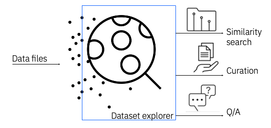
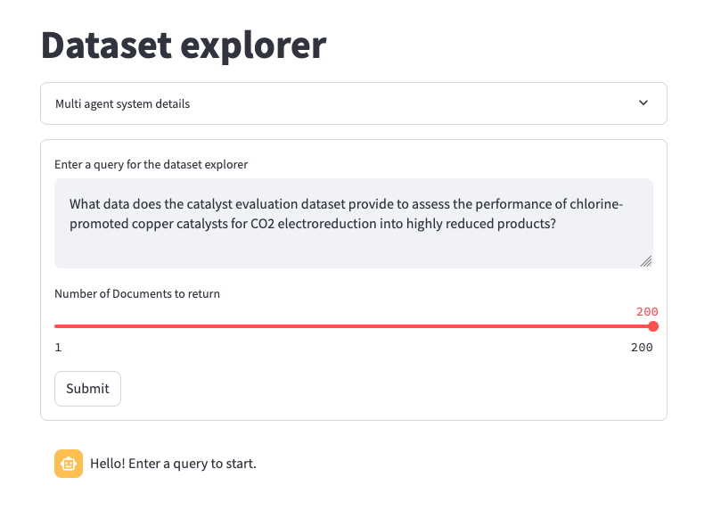

<a id="readme-top"></a>

# Dataset Explorer
[](https://arxiv.org/abs/2502.15718)


:bar_chart: Dataset Explorer is an interactive tool that simplifies the processing, visualization, and retrieveval of scientific datasets. Powered by [streamlit](https://streamlit.io/) and integrated with generative AI and Retrieval-Augmented Generation (RAG), this app lets you explore large collections of dataset with ease, generating natural language descriptions of the file contents and drawing similarity across data repositories.

Ideal for research repositories like Zenodo, Hugging Face datasets and local archives. 

### Features
- 🗂️ Multi-format document parsing — Load a wide range of file types including dataset related publications (parsed with [Docling](https://github.com/docling-project/docling/tree/main)), CSV, XLSX, TXT, and more. 
- 📝  Easily extend support with <a href="#extras">custom data loaders</a> for your own data formats
- 📁 Folder-level parsing and indexing — Automatically parse entire folders, generate a hierarchical summary and build a vector store for semantic search
- 🌐 Interactive navigation via Streamlit app — Browse, search, and explore your documents and vector stores visually and interactively
- 🔍 Similarity search across repositories — Compare and connect your custom datasets with public repositories like Zenodo or Hugging Face using semantic similarity search
- 💻 Streamlined CLI experience — A simple command-line interface

## :rocket: Quick demo (minimal setup)
Here is the fastest way to run the demo: 

```console
git clone https://github.com/AI4SD/dataset-explorer.git
cd dataset-explorer/

curl -LsSf https://astral.sh/uv/install.sh | sh

uv venv .venv 
source .venv/bin/activate
(.venv) uv pip install -r requirements.txt
(.venv) uv pip install -e . 

dataset-explorer-app
```
<a id="readme-metadata"></a>
## :page_facing_up: Run on your dataset metadata
To use the app, you need a dataset metadata file in JSON format. 
The JSON file should contain, for each entry, at least a `title`, `DOI` and a `metadata` section with a `description` field. Any of these fields can be empty, but they need to be present in the structure.

Check an example structure in the details below.

<details>

```json
[
    {
        "created": "2024-23-02T12:30:22",
        "id": 123456,
        "doi": "https://doi.org/10.2312/zenodo.159078742",
        "title": "Analyzing single-cell DNA data using Deep Learning",
        "metadata": {
            "description": "In this paper we present a novel way of analyzing notoriously complex single-cell DNA data produced in research laboratories.",
            "resource_type": {"title": "Dataset", "type": "dataset"},
            "creators": ["Jane Doe", "Joe Smith"],
        },
        "stats": {
            "downloads": 100,
            "unique_downloads": 20,
            "views": 5000
        },
        "files": [{"id": 89012, "size": 56789, "links": "https://zenodo.org/records/15230283"}]
    }
]
````

</details>

:bulb: Tip: you can retrieve metadata from Zenodo using their official [OAI-PMH](https://developers.zenodo.org/#oai-pmh) client.

### Automate dataset metadata creation
- From HF dataset
    ```console
    mkdir OUTPUT_DIR
    dataset-explorer-hf --dataset_name DATASET_NAME --output_directory OUTPUT_DIR
    ```
    Example:
    ```console
    mkdir iris-info
    dataset-explorer-hf --dataset_name scikit-learn/iris --output_directory ./iris-info
    ```
- From local folder
    ```console
    mkdir OUTPUT_DIR
    dataset-explorer-folder --dataset_name PATH_TO_DATASET_FOLDER --output_directory OUTPUT_DIR
    ```

    Example:
    ```console
    mkdir berka-info
    dataset-explorer-folder --dataset_name data/berka --output_directory ./berka-info
    ```
### Extras: Use HF metadata and custom data loaders
<a id="extras"></a>
Below additional details on how you can further customize the dataset explorer. 

<details>
### Get HF metadata

Below an example of how you can get HF metadata.
```
datasets = list_datasets(full=True)

datasets_info = []
for dataset in tqdm(datasets):
    num_examples = 0
    dataset_size = 0
    if dataset.card_data is not None:
        infos = dataset.card_data.to_dict().get("dataset_info", [])
        infos = infos if isinstance(infos, list) else [infos]
        datasets_info.append(infos)
```
### Add custom data loaders


Write your own `data_loader.py` and add it to the package, e.g. in `src/dataset_explorer/core/`.
Modify the DataAnalysisSettings in the configuration as follows
```
class DataAnalysisSettings(BaseSettings):
    """Base data analysis settings object."""

    supported_file_types_to_loader_map: Dict[str, str] = Field(default_factory=lambda: {
        ".csv": "pandas.read_csv",
        ".xlsx": "pandas.read_excel",
        ".json": "dataset_explorer.core.utils.read_json_content",
        ".custom": "myscript.read_custom_format",  # 👈 your new loader
    })
```
</details>

<p align="right">(<a href="#readme-top">back to top</a>)</p>

## :hammer_and_wrench: How it works
### 1. Configuration
The dataset explorer is integrated with different language models to generate natural language descriptions of the dataset. Below the configuration details for different providers. 

<details>

#### a. Ollama
- Install and start [Ollama](https://ollama.com/download).

- Change the configuration to use Ollama. 
    ````console
    ollama run llama3
    export provider="ollama"
    export language_model_name="llama3"
    ````

#### b. Huggingface API
- Read HF documentation to set an API token
- Change the configuration to use huggingface. 
    ````console
    export HUGGINGFACEHUB_API_TOKEN=your_key_here
    export provider="huggingface"
    export language_model_name=language_model_name_here
    ````
#### c. WatsonX API
- Read WatsonX documentation to set an API token and project id
- Change the configuration to use WatsonX
    ````console
    export WATSONX_APIKEY=your_key_here
    export WATSONX_PROJECT_ID=project_id_here
    export provider="watsonx"
    export language_model_name=language_model_name_here
    ````
#### d. Local model
- Run a small quantized model available on HF library on your local resources
    ````console
    export provider="local"
    export language_model_name=language_model_name_here
    ````

</details>

### 2. Get the metadata 
You can use the dataset explorer on:
-  a custom JSON file with metadata of large scale datasets (e.g. Zenodo or Hugging Face datasets)
- on a HF dataset from its name
- on a local data directory

For the details check <a href="#readme-metadata">here</a>.
<p align="right">(<a href="#readme-top">back to top</a>)</p>

### 3. Build the vector store 
```console
(.venv)$ dataset-explorer-vs --path_to_file PATH_TO_METADATA_FILE --nr_lines [NUMBER_OF_LINES_TO_READ] --output_directory [OUTPUT_DIR]
```

this will create a vector embedding base of the records stored in `PATH_TO_METADATA_FILE`.
If you do not have the metadata file, please see the section above on how to retrieve metadata.

Note that specifying a maximum `NUMBER_OF_LINES_TO_READ` is optional and crops the file at the specified number of lines. 
Processing the entire json may take a long time to finish. Set multiprocessing to speed up times `export multiprocessing=True`. 

A new subfolder `faiss_vector_store/` will be created with the vector embeddings stored `index.faiss` and `index.pkl`.

### 3b. Merge multiple vector stores to explore different datasets

You can merge the indexes obtained for each dataset or collection of datasets into a single index to visualize all the data in the app. 

```
(.venv) dataset-explorer-merge-vs [PATH_TO_VECTOR_STORE_DIR] [PATH_TO_VECTOR_STORE_DIR] ... --output_directory [OUTPUT_DIR]
```

Example: 

```
(.venv) dataset-explorer-merge-vs  'iris-info/faiss_vector_store' 'berka-info/faiss_vector_store' --output_directory ./datasets-info
```

<p align="right">(<a href="#readme-top">back to top</a>)</p>

### 4. Launch the streamlit app
Now we can run the app in your local browser

```console
(.venv)$ dataset-explorer-app
```

The browser will open a page similar to this one



you can enter any query describing the type of dataset you are looking for and select how many retrieval hits you want to return.
If you hover over a retrival hit dot in the graph, a panel in the left hand side will open with an LLM description of the dataset and the raw user-provided record description.


Happy exploring your dataset! :tada:
<p align="right">(<a href="#readme-top">back to top</a>)</p>


## Citation
Below is the publication associated with this repo, plase cite the paper and leave a star if you found it useful! :star: :heart:

```bibtex
@misc{graziani2025makingsensedatawild,
      title={Making Sense of Data in the Wild: Data Analysis Automation at Scale}, 
      author={Mara Graziani and Malina Molnar and Irina Espejo Morales and Joris Cadow-Gossweiler and Teodoro Laino},
      year={2025},
      eprint={2502.15718},
      archivePrefix={arXiv},
      primaryClass={cs.IR},
      url={https://arxiv.org/abs/2502.15718}, 
}
```
